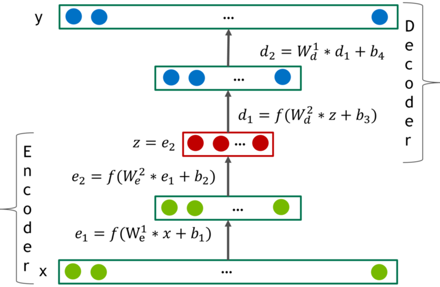

# Deep AutoEncoders for Collaborative Filtering
This is not an official NVIDIA product. It is a research project described in: "Training Deep AutoEncoders for Collaborative Filtering"(https://arxiv.org/abs/1708.01715)

### The model
The model is based on deep AutoEncoders.



## Requirements
* Python 3.6
* [Pytorch](http://pytorch.org/)
* CUDA (recommended version is 8.0)

## Getting Started

### Run unittests first
The code is intended to run on GPU. Last test can take a minute or two.
```
$ python -m unittest test/data_layer_tests.py
$ python -m unittest test/test_model.py
```

### Get the data

**Note: Run all these commands within your `DeepRecommender` folder**

[Netflix prize](http://netflixprize.com/)

* Download from [here](http://academictorrents.com/details/9b13183dc4d60676b773c9e2cd6de5e5542cee9a) into your ```DeepRecommender``` folder
```
$ tar -xvf nf_prize_dataset.tar.gz
$ tar -xf download/training_set.tar
$ python ./data_utils/netflix_data_convert.py training_set Netflix
```

#### Data stats
| Dataset  | Netflix 3 months | Netflix 6 months | Netflix 1 year | Netflix full |
| -------- | ---------------- | ---------------- | ----------- |  ------------ |
| Ratings train | 13,675,402 | 29,179,009 | 41,451,832 | 98,074,901 |
| Users train | 311,315 |390,795  | 345,855 | 477,412 |
| Items train | 17,736 |17,757  | 16,907 | 17,768 |
| Time range train | 2005-09-01 to 2005-11-31 | 2005-06-01 to 2005-11-31 | 2004-06-01 to 2005-05-31 | 1999-12-01 to 2005-11-31
| -------- | ---------------- | ----------- |  ------------ |
| Ratings test | 2,082,559 | 2,175,535  | 3,888,684| 2,250,481 |
| Users test | 160,906 | 169,541  | 197,951| 173,482 |
| Items test | 17,261 | 17,290  | 16,506| 17,305 |
| Time range test | 2005-12-01 to 2005-12-31 | 2005-12-01 to 2005-12-31 | 2005-06-01 to 2005-06-31 | 2005-12-01 to 2005-12-31

### Train the model
In this example, the model will be trained for 12 epochs. In paper we train for 102.
```
python run.py --gpu_ids 0 \
--path_to_train_data Netflix/NF_TRAIN \
--path_to_eval_data Netflix/NF_VALID \
--hidden_layers 512,512,1024 \
--non_linearity_type selu \
--batch_size 128 \
--logdir model_save \
--drop_prob 0.8 \
--optimizer momentum \
--lr 0.005 \
--weight_decay 0 \
--aug_step 1 \
--noise_prob 0 \
--num_epochs 12 \
--summary_frequency 1000
```

Note that you can run Tensorboard in parallel
```
$ tensorboard --logdir=model_save
```

### Run inference on the Test set
```
python infer.py \
--path_to_train_data Netflix/NF_TRAIN \
--path_to_eval_data Netflix/NF_TEST \
--hidden_layers 512,512,1024 \
--non_linearity_type selu \
--save_path model_save/model.epoch_11 \
--drop_prob 0.8 \
--predictions_path preds.txt
```

### Compute Test RMSE
```
python compute_RMSE.py --path_to_predictions=preds.txt
```
After 12 epochs you should get RMSE around 0.927. Train longer to get below 0.92

# Results
It should be possible to achieve the following results. Iterative output re-feeding should be applied
once during each iteration.

(exact numbers will vary due to randomization)

| DataSet | RMSE | Model Architecture |
| -------- | ---------------- | ---------------- |
| Netflix 3 months | 0.9373 | n,128,256,256,dp(0.65),256,128,n |
| Netflix 6 months | 0.9207 | n,256,256,512,dp(0.8),256,256,n |
| Netflix 1 year | 0.9225 | n,256,256,512,dp(0.8),256,256,n |
| Netflix full | 0.9099 | n,512,512,1024,dp(0.8),512,512,n |
